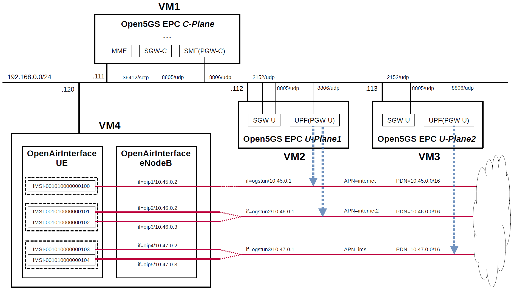

# Open5GS EPC & OpenAirInterface UE / RAN Sample Configuration
From Open5GS v2.0.22, it is possible to connect to OpenAirInterface UE / RAN v1.0.3.
Therefore, in order to use U-Plane's PDN (Packet Data Network) as a trial, I built a simulation environment for the CUPS-enabled EPC mobile network.
This briefly describes the overall and configuration files.

---

<h2 id="toc">Table of Contents</h2>

- [Overview of Open5GS CUPS-enabled EPC Simulation Mobile Network](#overview)
- [Changes in configuration files of Open5GS EPC and OAI UE / RAN](#changes)
  - [Changes in configuration files of Open5GS EPC C-Plane](#changes_cp)
  - [Changes in configuration files of Open5GS EPC U-Plane1](#changes_up1)
  - [Changes in configuration files of Open5GS EPC U-Plane2](#changes_up2)
  - [Changes in configuration files of OAI UE / RAN](#changes_oai)
    - [Changes in configuration files of UE](#changes_ue)
    - [Changes in configuration files of RAN](#changes_ran)
- [Note about building Open5GS EPC and OAI UE / RAN](#note)
- [Network settings of Open5GS EPC and OAI UE / RAN](#network_settings)
  - [Network settings of Open5GS EPC U-Plane1](#network_settings_up1)
  - [Network settings of Open5GS EPC U-Plane2](#network_settings_up2)
  - [Network settings of OAI UE / RAN](#network_settings_oai)
- [Build Open5GS and OAI UE / RAN](#build)
- [Run Open5GS EPC and OAI UE / RAN](#run)
  - [Run Open5GS EPC U-Plane1 & U-Plane2](#run_up)
  - [Run Open5GS EPC C-Plane](#run_cp)
  - [Run OAI RAN](#run_ran)
  - [Run OAI 5 UEs](#run_ue)
- [Ping google.com](#ping)
  - [Case for going through PDN 10.45.0.0/16](#ping_1)
  
---

<h2 id="overview">Overview of Open5GS CUPS-enabled EPC Simulation Mobile Network</h2>

I created a CUPS-enabled EPC mobile network (Internet reachable) for simulation with the aim of creating an environment in which packets can be sent end-to-end with different PDNs for each APN.

The built simulation environment is as follows.

</img>

Note. The PDN end-point addresses assigned to `oipX` TUNnel interfaces are not always in the order shown in the figure above.

The EPC / UE / RAN used are as follows.
- EPC - Open5GS v2.0.22 or later - https://github.com/open5gs/open5gs
- UE / RAN - OpenAirInterface(OAI) v1.0.3 - https://gitlab.eurecom.fr/oai/openairinterface5g/-/tree/v1.0.3

Each VMs are as follows.  
| VM # | SW & Role | IP address | OS |
| --- | --- | --- | --- |
| VM1 | Open5GS EPC C-Plane | 192.168.0.111/24 | Ubuntu 20.04 |
| VM2 | Open5GS EPC U-Plane1  | 192.168.0.112/24 | Ubuntu 20.04 |
| VM3 | Open5GS EPC U-Plane2  | 192.168.0.113/24 | Ubuntu 20.04 |
| VM4 | OpenAirInterface UE / RAN | 192.168.0.120/24 | Ubuntu 18.04 |

OAI UE / RAN cannot be built on Ubuntu 20.04, so build it on Ubuntu 18.04.

Subscriber Information (other information is the same) is as follows.  
| UE # | IMSI | APN |
| --- | --- | --- |
| UE0 | 001010000000100 | internet |
| UE1 | 001010000000101 | internet2 |
| UE2 | 001010000000102 | internet2 |
| UE3 | 001010000000103 | ims |
| UE4 | 001010000000104 | ims |

I registered these information with the Open5GS WebUI.

Each PDNs are as follows.
| U-Plane # | TUNnel interface of U-Plane | PDN | APN | TUNnel interface of UE |
| --- | --- | --- | --- | --- |
| U-Plane1 | ogstun | 10.45.0.0/16 | internet | oip1 |
| U-Plane1 | ogstun2 | 10.46.0.0/16 | internet2 | oip2, oip3 |
| U-Plane2 | ogstun3 | 10.47.0.0/16 | ims | oip4, oip5 |

<h2 id="changes">Changes in configuration files of Open5GS EPC and OAI UE / RAN</h2>

Please refer to the following for building Open5GS and OAI UE / RAN respectively.
- Open5GS v2.0.22 or later - https://open5gs.org/open5gs/docs/guide/02-building-open5gs-from-sources/
- OAI UE / RAN v1.0.3 - https://gitlab.eurecom.fr/oai/openairinterface5g/-/wikis/l2-nfapi-simulator/l2-nfapi-simulator-w-S1-same-machine

<h3 id="changes_cp">Changes in configuration files of Open5GS EPC C-Plane</h3>

- `open5gs/install/etc/open5gs/mme.yaml`
```diff
--- mme.yaml.orig       2020-11-22 14:02:40.000000000 +0000
+++ mme.yaml    2020-11-24 00:37:00.408780180 +0000
@@ -204,19 +204,19 @@
 mme:
     freeDiameter: /root/open5gs/install/etc/freeDiameter/mme.conf
     s1ap:
-      - addr: 127.0.0.2
+      - addr: 192.168.0.111
     gtpc:
       - addr: 127.0.0.2
     gummei: 
       plmn_id:
-        mcc: 901
-        mnc: 70
+        mcc: 001
+        mnc: 01
       mme_gid: 2
       mme_code: 1
     tai:
       plmn_id:
-        mcc: 901
-        mnc: 70
+        mcc: 001
+        mnc: 01
       tac: 1
     security:
         integrity_order : [ EIA2, EIA1, EIA0 ]
@@ -350,6 +350,7 @@
 #      no_slaac: true
 #
 parameter:
+    use_openair: true
 
 #
 # max:
```
When connecting with OpenAirInterface UE / RAN v1.0.3, add the following.
```
parameter:
    use_openair: true
```
- `open5gs/install/etc/open5gs/sgwc.yaml`
```diff
--- sgwc.yaml.orig      2020-11-22 05:02:39.303016638 +0000
+++ sgwc.yaml   2020-11-22 14:58:25.875876182 +0000
@@ -49,7 +49,7 @@
     gtpc:
       - addr: 127.0.0.3
     pfcp:
-      - addr: 127.0.0.3
+      - addr: 192.168.0.111
 
 #
 # sgwu:
@@ -105,7 +105,10 @@
 #
 sgwu:
     pfcp:
-      - addr: 127.0.0.6
+      - addr: 192.168.0.112
+        apn: [internet, internet2]
+      - addr: 192.168.0.113
+        apn: ims
 
 #
 # parameter
```
- `open5gs/install/etc/open5gs/smf.yaml`
```diff
--- smf.yaml.orig       2020-11-20 13:25:35.000000000 +0000
+++ smf.yaml    2020-11-22 16:26:52.912387840 +0000
@@ -175,11 +175,18 @@
       - addr: 127.0.0.4
       - addr: ::1
     pfcp:
-      - addr: 127.0.0.4
-      - addr: ::1
+      - addr: 192.168.0.111
+        port: 8806
     pdn:
       - addr: 10.45.0.1/16
-      - addr: cafe::1/64
+        apn: internet
+        dev: ogstun
+      - addr: 10.46.0.1/16
+        apn: internet2
+        dev: ogstun2
+      - addr: 10.47.0.1/16
+        apn: ims
+        dev: ogstun3
     dns:
       - 8.8.8.8
       - 8.8.4.4
@@ -275,7 +282,12 @@
 #
 upf:
     pfcp:
-      - addr: 127.0.0.7
+      - addr: 192.168.0.112
+        port: 8806
+        apn: [internet, internet2]
+      - addr: 192.168.0.113
+        port: 8806
+        apn: ims
 
 #
 # parameter
```

<h3 id="changes_up1">Changes in configuration files of Open5GS EPC U-Plane1</h3>

- `open5gs/install/etc/open5gs/sgwu.yaml`
```diff
--- sgwu.yaml.orig      2020-11-22 13:00:41.183869107 +0000
+++ sgwu.yaml   2020-11-22 15:00:56.962657955 +0000
@@ -82,9 +82,9 @@
 #
 sgwu:
     gtpu:
-      - addr: 127.0.0.6
+      - addr: 192.168.0.112
     pfcp:
-      - addr: 127.0.0.6
+      - addr: 192.168.0.112
 
 #
 # sgwc:
```
- `open5gs/install/etc/open5gs/upf.yaml`
```diff
--- upf.yaml.orig       2020-11-22 13:00:41.283862056 +0000
+++ upf.yaml    2020-11-22 16:15:24.054506383 +0000
@@ -163,12 +163,17 @@
 #
 upf:
     pfcp:
-      - addr: 127.0.0.7
+      - addr: 192.168.0.112
+        port: 8806
     gtpu:
       - addr: 127.0.0.7
     pdn:
       - addr: 10.45.0.1/16
-      - addr: cafe::1/64
+        apn: internet
+        dev: ogstun
+      - addr: 10.46.0.1/16
+        apn: internet2
+        dev: ogstun2
 
 #
 # smf:
```

<h3 id="changes_up2">Changes in configuration files of Open5GS EPC U-Plane2</h3>

- `open5gs/install/etc/open5gs/sgwu.yaml`
```diff
--- sgwu.yaml.orig      2020-11-22 14:20:21.432061768 +0000
+++ sgwu.yaml   2020-11-22 14:24:41.221864000 +0000
@@ -82,9 +82,9 @@
 #
 sgwu:
     gtpu:
-      - addr: 127.0.0.6
+      - addr: 192.168.0.113
     pfcp:
-      - addr: 127.0.0.6
+      - addr: 192.168.0.113
 
 #
 # sgwc:
```
- `open5gs/install/etc/open5gs/upf.yaml`
```diff
--- upf.yaml.orig       2020-11-22 14:20:21.528050903 +0000
+++ upf.yaml    2020-11-22 16:15:48.880073970 +0000
@@ -163,12 +163,14 @@
 #
 upf:
     pfcp:
-      - addr: 127.0.0.7
+      - addr: 192.168.0.113
+        port: 8806
     gtpu:
       - addr: 127.0.0.7
     pdn:
-      - addr: 10.45.0.1/16
-      - addr: cafe::1/64
+      - addr: 10.47.0.1/16
+        apn: ims
+        dev: ogstun3
 
 #
 # smf:
```

<h3 id="changes_oai">Changes in configuration files of OAI UE / RAN</h3>

<h4 id="changes_ue">Changes in configuration files of UE</h4>

- `ue_folder/ci-scripts/conf_files/ue.nfapi.conf`
```diff
--- ue.nfapi.conf.orig  2020-11-22 07:54:40.846830672 +0000
+++ ue.nfapi.conf       2020-09-23 08:01:54.000000000 +0000
@@ -21,8 +21,8 @@
        num_cc = 1;
        tr_n_preference = "nfapi";
        local_n_if_name  = "lo";
-       remote_n_address = "127.0.0.2";
-       local_n_address  = "127.0.0.1";
+       remote_n_address = "127.0.0.1";
+       local_n_address  = "127.0.0.2";
        local_n_portc    = 50000;
        remote_n_portc   = 50001;
        local_n_portd    = 50010;
```
- `ue_folder/openair3/NAS/TOOLS/ue_eurecom_test_sfr.conf`
```diff
--- ue_eurecom_test_sfr.conf.orig       2020-11-22 15:33:56.000000000 +0000
+++ ue_eurecom_test_sfr.conf    2020-11-24 02:38:41.104185570 +0000
@@ -86,14 +86,162 @@
     };
 
     SIM: {
-        MSIN="0100001111";
-        USIM_API_K="8baf473f2f8fd09487cccbd7097c6862";
-        OPC="e734f8734007d6c5ce7a0508809e7e9c";
+        MSIN="0000000100";
+        USIM_API_K="465B5CE8B199B49FAA5F0A2EE238A6BC";
+        OPC="E8ED289DEBA952E4283B54E88E6183CA";
         MSISDN="33611123456";
     };
 
     # Home PLMN Selector with Access Technology
-    HPLMN= "20893";
+    HPLMN= "00101";
+
+    # User controlled PLMN Selector with Access Technology
+    UCPLMN_LIST = ();
+
+    # Operator PLMN List
+    OPLMN_LIST = ("00101", "20810", "20811", "20813", "20893", "310280", "310028");
+
+    # Operator controlled PLMN Selector with Access Technology
+    OCPLMN_LIST = ("22210", "21401", "21406", "26202", "26204");
+
+    # Forbidden plmns
+    FPLMN_LIST = ();
+
+    # List of Equivalent HPLMNs
+#TODO: UE does not connect if set, to be fixed in the UE
+#    EHPLMN_LIST= ("20811", "20813");
+    EHPLMN_LIST= ();
+};
+
+UE1:
+{
+    USER: {
+        IMEI="356113022094149";
+        MANUFACTURER="EURECOM";
+        MODEL="LTE Android PC";
+        PIN="0000";
+    };
+
+    SIM: {
+        MSIN="0000000101";
+        USIM_API_K="465B5CE8B199B49FAA5F0A2EE238A6BC";
+        OPC="E8ED289DEBA952E4283B54E88E6183CA";
+        MSISDN="33611123456";
+    };
+
+    # Home PLMN Selector with Access Technology
+    HPLMN= "00101";
+
+    # User controlled PLMN Selector with Access Technology
+    UCPLMN_LIST = ();
+
+    # Operator PLMN List
+    OPLMN_LIST = ("00101", "20810", "20811", "20813", "20893", "310280", "310028");
+
+    # Operator controlled PLMN Selector with Access Technology
+    OCPLMN_LIST = ("22210", "21401", "21406", "26202", "26204");
+
+    # Forbidden plmns
+    FPLMN_LIST = ();
+
+    # List of Equivalent HPLMNs
+#TODO: UE does not connect if set, to be fixed in the UE
+#    EHPLMN_LIST= ("20811", "20813");
+    EHPLMN_LIST= ();
+};
+
+UE2:
+{
+    USER: {
+        IMEI="356113022094149";
+        MANUFACTURER="EURECOM";
+        MODEL="LTE Android PC";
+        PIN="0000";
+    };
+
+    SIM: {
+        MSIN="0000000102";
+        USIM_API_K="465B5CE8B199B49FAA5F0A2EE238A6BC";
+        OPC="E8ED289DEBA952E4283B54E88E6183CA";
+        MSISDN="33611123456";
+    };
+
+    # Home PLMN Selector with Access Technology
+    HPLMN= "00101";
+
+    # User controlled PLMN Selector with Access Technology
+    UCPLMN_LIST = ();
+
+    # Operator PLMN List
+    OPLMN_LIST = ("00101", "20810", "20811", "20813", "20893", "310280", "310028");
+
+    # Operator controlled PLMN Selector with Access Technology
+    OCPLMN_LIST = ("22210", "21401", "21406", "26202", "26204");
+
+    # Forbidden plmns
+    FPLMN_LIST = ();
+
+    # List of Equivalent HPLMNs
+#TODO: UE does not connect if set, to be fixed in the UE
+#    EHPLMN_LIST= ("20811", "20813");
+    EHPLMN_LIST= ();
+};
+
+UE3:
+{
+    USER: {
+        IMEI="356113022094149";
+        MANUFACTURER="EURECOM";
+        MODEL="LTE Android PC";
+        PIN="0000";
+    };
+
+    SIM: {
+        MSIN="0000000103";
+        USIM_API_K="465B5CE8B199B49FAA5F0A2EE238A6BC";
+        OPC="E8ED289DEBA952E4283B54E88E6183CA";
+        MSISDN="33611123456";
+    };
+
+    # Home PLMN Selector with Access Technology
+    HPLMN= "00101";
+
+    # User controlled PLMN Selector with Access Technology
+    UCPLMN_LIST = ();
+
+    # Operator PLMN List
+    OPLMN_LIST = ("00101", "20810", "20811", "20813", "20893", "310280", "310028");
+
+    # Operator controlled PLMN Selector with Access Technology
+    OCPLMN_LIST = ("22210", "21401", "21406", "26202", "26204");
+
+    # Forbidden plmns
+    FPLMN_LIST = ();
+
+    # List of Equivalent HPLMNs
+#TODO: UE does not connect if set, to be fixed in the UE
+#    EHPLMN_LIST= ("20811", "20813");
+    EHPLMN_LIST= ();
+};
+
+UE4:
+{
+    USER: {
+        IMEI="356113022094149";
+        MANUFACTURER="EURECOM";
+        MODEL="LTE Android PC";
+        PIN="0000";
+    };
+
+    SIM: {
+        MSIN="0000000104";
+        USIM_API_K="465B5CE8B199B49FAA5F0A2EE238A6BC";
+        OPC="E8ED289DEBA952E4283B54E88E6183CA";
+        MSISDN="33611123456";
+    };
+
+    # Home PLMN Selector with Access Technology
+    HPLMN= "00101";
 
     # User controlled PLMN Selector with Access Technology
     UCPLMN_LIST = ();
```
<h4 id="changes_ran">Changes in configuration files of RAN</h4>

- `enb_folder/ci-scripts/conf_files/rcc.band7.tm1.nfapi.conf`
```diff
--- rcc.band7.tm1.nfapi.conf.orig       2020-11-22 15:33:38.000000000 +0000
+++ rcc.band7.tm1.nfapi.conf    2020-11-24 01:00:23.936598997 +0000
@@ -15,7 +15,7 @@
     // Tracking area code, 0x0000 and 0xfffe are reserved values
     tracking_area_code = 1;
 
-    plmn_list = ( { mcc = 208; mnc = 93; mnc_length = 2; } );
+    plmn_list = ( { mcc = 001; mnc = 01; mnc_length = 2; } );
 
     tr_s_preference     = "local_mac"
 
@@ -172,7 +172,7 @@
 
 
     ////////// MME parameters:
-    mme_ip_address      = ( { ipv4       = "CI_MME_IP_ADDR";
+    mme_ip_address      = ( { ipv4       = "192.168.0.111";
                               ipv6       = "192:168:30::17";
                               active     = "yes";
                               preference = "ipv4";
@@ -181,12 +181,12 @@
 
     NETWORK_INTERFACES :
     {
-        ENB_INTERFACE_NAME_FOR_S1_MME            = "ens3";
-        ENB_IPV4_ADDRESS_FOR_S1_MME              = "CI_ENB_IP_ADDR";
-        ENB_INTERFACE_NAME_FOR_S1U               = "ens3";
-        ENB_IPV4_ADDRESS_FOR_S1U                 = "CI_ENB_IP_ADDR";
+        ENB_INTERFACE_NAME_FOR_S1_MME            = "enp0s8";
+        ENB_IPV4_ADDRESS_FOR_S1_MME              = "192.168.0.120/24";
+        ENB_INTERFACE_NAME_FOR_S1U               = "enp0s8";
+        ENB_IPV4_ADDRESS_FOR_S1U                 = "192.168.0.120/24";
         ENB_PORT_FOR_S1U                         = 2152; # Spec 2152
-        ENB_IPV4_ADDRESS_FOR_X2C                 = "CI_ENB_IP_ADDR";
+        ENB_IPV4_ADDRESS_FOR_X2C                 = "192.168.0.120/24";
         ENB_PORT_FOR_X2C                         = 36422; # Spec 36422
         
     };
@@ -197,8 +197,8 @@
        {
        num_cc = 1;
        local_s_if_name  = "lo:";                         
-       remote_s_address = "127.0.0.1";
-       local_s_address  = "127.0.0.2"; 
+       remote_s_address = "127.0.0.2";
+       local_s_address  = "127.0.0.1"; 
        local_s_portc    = 50001;
        remote_s_portc   = 50000;
        local_s_portd    = 50011;
```

<h2 id="note">Note about building Open5GS EPC and OAI UE / RAN</h2>

When building OAI UE / RAN, add `-I` to the parameter of the` build_oai` command for the first time.
The following is an example of building eNB.
```
./build_oai -I --eNB -t ETHERNET -c
```

<h2 id="network_settings">Network settings of Open5GS EPC and OAI UE / RAN</h2>

<h3 id="network_settings_up1">Network settings of Open5GS EPC U-Plane1</h3>

```
ip tuntap add name ogstun mode tun
ip addr add 10.45.0.1/16 dev ogstun
ip addr add cafe::1/64 dev ogstun
ip link set ogstun up

iptables -t nat -A POSTROUTING -s 10.45.0.0/16 ! -o ogstun -j MASQUERADE

ip tuntap add name ogstun2 mode tun
ip addr add 10.46.0.1/16 dev ogstun2
ip addr add cafe::2/64 dev ogstun2
ip link set ogstun2 up

iptables -t nat -A POSTROUTING -s 10.46.0.0/16 ! -o ogstun2 -j MASQUERADE
```

<h3 id="network_settings_up2">Network settings of Open5GS EPC U-Plane2</h3>

```
ip tuntap add name ogstun3 mode tun
ip addr add 10.47.0.1/16 dev ogstun3
ip addr add cafe::3/64 dev ogstun3
ip link set ogstun3 up

iptables -t nat -A POSTROUTING -s 10.47.0.0/16 ! -o ogstun3 -j MASQUERADE
```

<h3 id="network_settings_oai">Network settings of OAI UE / RAN</h3>

```
ifconfig lo: 127.0.0.2 netmask 255.0.0.0 up
```

<h2 id="build">Build Open5GS and OAI UE / RAN</h2>

Please refer to the following for building Open5GS and OAI UE / RAN respectively.
- Open5GS v2.0.22 or later - https://open5gs.org/open5gs/docs/guide/02-building-open5gs-from-sources/
- OAI UE / RAN v1.0.3 - https://gitlab.eurecom.fr/oai/openairinterface5g/-/wikis/l2-nfapi-simulator/l2-nfapi-simulator-w-S1-same-machine

<h2 id="run">Run Open5GS EPC and OAI UE / RAN</h2>

First run the EPC, then the RAN, and the UE.

<h3 id="run_up">Run Open5GS EPC U-Plane1 & U-Plane2</h3>

Run Open5GS EPC U-Plane before the C-Plane.

- Open5GS EPC U-Plane1
```
./install/bin/open5gs-sgwud &
./install/bin/open5gs-upfd &
```
- Open5GS EPC U-Plane2
```
./install/bin/open5gs-sgwud &
./install/bin/open5gs-upfd &
```

<h3 id="run_cp">Run Open5GS EPC C-Plane</h3>

Next, run the C-Plane.
In addition, when run SMF (PGW-C), NRF also runs because it connects to NRF for registration as a function of 5GC of SMF.
By changing the configuration file, it is no longer necessary to run NRF, but for the sake of simplicity, I will leave it as it is here.

- Open5GS EPC C-Plane
```
./install/bin/open5gs-nrfd &
sleep 5
./install/bin/open5gs-mmed &
./install/bin/open5gs-sgwcd &
./install/bin/open5gs-smfd &
./install/bin/open5gs-hssd &
./install/bin/open5gs-pcrfd &
```

<h3 id="run_ran">Run OAI RAN</h3>

Run OAI eNB and connect to Open5GS EPC.
```
# cd ~/enb_folder
# source oaienv
# cd cmake_targets
# ./lte_build_oai/build/lte-softmodem -O ../ci-scripts/conf_files/rcc.band7.tm1.nfapi.conf 2>&1 | tee enb.log
```
The Open5GS C-Plane log when executed is as follows.
```
11/24 11:00:15.563: [mme] INFO: eNB-S1 accepted[192.168.0.120]:36412 in s1_path module (../src/mme/s1ap-sctp.c:108)
11/24 11:00:15.563: [mme] INFO: eNB-S1 accepted[192.168.0.120] in master_sm module (../src/mme/mme-sm.c:172)
11/24 11:00:15.563: [mme] INFO: [Added] Number of eNBs is now 1 (../src/mme/mme-context.c:1914)
```

<h3 id="run_ue">Run OAI 5 UEs</h3>

Run OAI 5 UEs and connect to Open5GS EPC.
Add `--num-ues 5` to the parameter to use 5 UEs.
```
# cd ~/ue_folder
# source oaienv
# cd cmake_targets/tools
# source init_nas_s1 UE
# cd ~/ue_folder/cmake_targets
# ./lte_build_oai/build/lte-uesoftmodem -O ../ci-scripts/conf_files/ue.nfapi.conf --L2-emul 3 --num-ues 5 2>&1 | tee ue.log
```
The Open5GS C-Plane log when executed is as follows.
5 UEs connected to the EPC and each PDU session was established.
```
11/24 11:00:54.862: [mme] INFO: [Added] Number of eNB-UEs is now 1 (../src/mme/mme-context.c:3280)
11/24 11:00:54.863: [mme] INFO: [001010000000100] Unknown UE by IMSI (../src/mme/mme-context.c:2382)
11/24 11:00:54.863: [mme] INFO: [Added] Number of MME-UEs is now 1 (../src/mme/mme-context.c:2232)
11/24 11:00:54.902: [mme] INFO: [Added] Number of MME-Sessions is now 1 (../src/mme/mme-context.c:3292)
11/24 11:00:54.903: [sgwc] INFO: [Added] Number of SGWC-UEs is now 1 (../src/sgwc/context.c:333)
11/24 11:00:54.903: [sgwc] INFO: [Added] Number of SGWC-Sessions is now 1 (../src/sgwc/context.c:961)
11/24 11:00:54.975: [gtp] INFO: gtp_connect() [127.0.0.4]:2123 (../lib/gtp/path.c:58)
11/24 11:00:54.975: [smf] INFO: [Added] Number of SMF-UEs is now 1 (../src/smf/context.c:557)
11/24 11:00:54.975: [smf] INFO: [Added] Number of SMF-Sessions is now 1 (../src/smf/context.c:1848)
11/24 11:00:54.975: [smf] INFO: UE IMSI:[001010000000100] APN:[internet] IPv4:[10.45.0.2] IPv6:[] (../src/smf/s5c-handler.c:157)
11/24 11:00:55.063: [mme] INFO: [Added] Number of eNB-UEs is now 2 (../src/mme/mme-context.c:3280)
11/24 11:00:55.063: [mme] INFO: [001010000000101] Unknown UE by IMSI (../src/mme/mme-context.c:2382)
11/24 11:00:55.063: [mme] INFO: [Added] Number of MME-UEs is now 2 (../src/mme/mme-context.c:2232)
11/24 11:00:55.293: [mme] INFO: [Added] Number of MME-Sessions is now 2 (../src/mme/mme-context.c:3292)
11/24 11:00:55.294: [sgwc] INFO: [Added] Number of SGWC-UEs is now 2 (../src/sgwc/context.c:333)
11/24 11:00:55.294: [sgwc] INFO: [Added] Number of SGWC-Sessions is now 2 (../src/sgwc/context.c:961)
11/24 11:00:55.357: [smf] INFO: [Added] Number of SMF-UEs is now 2 (../src/smf/context.c:557)
11/24 11:00:55.357: [smf] INFO: [Added] Number of SMF-Sessions is now 2 (../src/smf/context.c:1848)
11/24 11:00:55.357: [smf] INFO: UE IMSI:[001010000000101] APN:[internet2] IPv4:[10.46.0.2] IPv6:[] (../src/smf/s5c-handler.c:157)
11/24 11:00:55.653: [mme] INFO: [Added] Number of eNB-UEs is now 3 (../src/mme/mme-context.c:3280)
11/24 11:00:55.653: [mme] INFO: [001010000000103] Unknown UE by IMSI (../src/mme/mme-context.c:2382)
11/24 11:00:55.654: [mme] INFO: [Added] Number of MME-UEs is now 3 (../src/mme/mme-context.c:2232)
11/24 11:00:55.663: [mme] INFO: [Added] Number of eNB-UEs is now 4 (../src/mme/mme-context.c:3280)
11/24 11:00:55.663: [mme] INFO: [001010000000104] Unknown UE by IMSI (../src/mme/mme-context.c:2382)
11/24 11:00:55.663: [mme] INFO: [Added] Number of MME-UEs is now 4 (../src/mme/mme-context.c:2232)
11/24 11:00:55.705: [mme] INFO: [Added] Number of MME-Sessions is now 3 (../src/mme/mme-context.c:3292)
11/24 11:00:55.705: [sgwc] INFO: [Added] Number of SGWC-UEs is now 3 (../src/sgwc/context.c:333)
11/24 11:00:55.705: [sgwc] INFO: [Added] Number of SGWC-Sessions is now 3 (../src/sgwc/context.c:961)
11/24 11:00:55.774: [smf] INFO: [Added] Number of SMF-UEs is now 3 (../src/smf/context.c:557)
11/24 11:00:55.775: [smf] INFO: [Added] Number of SMF-Sessions is now 3 (../src/smf/context.c:1848)
11/24 11:00:55.775: [smf] INFO: UE IMSI:[001010000000104] APN:[ims] IPv4:[10.47.0.2] IPv6:[] (../src/smf/s5c-handler.c:157)
11/24 11:00:55.845: [mme] INFO: [Added] Number of MME-Sessions is now 4 (../src/mme/mme-context.c:3292)
11/24 11:00:55.845: [sgwc] INFO: [Added] Number of SGWC-UEs is now 4 (../src/sgwc/context.c:333)
11/24 11:00:55.846: [sgwc] INFO: [Added] Number of SGWC-Sessions is now 4 (../src/sgwc/context.c:961)
11/24 11:00:55.911: [smf] INFO: [Added] Number of SMF-UEs is now 4 (../src/smf/context.c:557)
11/24 11:00:55.911: [smf] INFO: [Added] Number of SMF-Sessions is now 4 (../src/smf/context.c:1848)
11/24 11:00:55.911: [smf] INFO: UE IMSI:[001010000000103] APN:[ims] IPv4:[10.47.0.3] IPv6:[] (../src/smf/s5c-handler.c:157)
11/24 11:01:05.502: [mme] INFO: [Added] Number of eNB-UEs is now 5 (../src/mme/mme-context.c:3280)
11/24 11:01:05.502: [mme] INFO: [001010000000102] Unknown UE by IMSI (../src/mme/mme-context.c:2382)
11/24 11:01:05.502: [mme] INFO: [Added] Number of MME-UEs is now 5 (../src/mme/mme-context.c:2232)
11/24 11:01:05.558: [mme] INFO: [Added] Number of MME-Sessions is now 5 (../src/mme/mme-context.c:3292)
11/24 11:01:05.558: [sgwc] INFO: [Added] Number of SGWC-UEs is now 5 (../src/sgwc/context.c:333)
11/24 11:01:05.558: [sgwc] INFO: [Added] Number of SGWC-Sessions is now 5 (../src/sgwc/context.c:961)
11/24 11:01:05.616: [smf] INFO: [Added] Number of SMF-UEs is now 5 (../src/smf/context.c:557)
11/24 11:01:05.616: [smf] INFO: [Added] Number of SMF-Sessions is now 5 (../src/smf/context.c:1848)
11/24 11:01:05.616: [smf] INFO: UE IMSI:[001010000000102] APN:[internet2] IPv4:[10.46.0.3] IPv6:[] (../src/smf/s5c-handler.c:157)
```
The Open5GS U-Plane1 log when executed is as follows.
3 GTP-U sessions have been created.
```
11/24 11:00:54.917: [sgwu] INFO: UE F-SEID[CP:0x1,UP:0x1] APN[internet] PDN-Type[1] (../src/sgwu/context.c:438)
11/24 11:00:54.917: [sgwu] INFO: [Added] Number of SGWU-Sessions is now 1 (../src/sgwu/context.c:443)
11/24 11:00:54.978: [upf] INFO: UE F-SEID[CP:0x1,UP:0x1] APN[internet] PDN-Type[1] IPv4[10.45.0.2] IPv6[] (../src/upf/context.c:492)
11/24 11:00:54.978: [upf] INFO: [Added] Number of UPF-Sessions is now 1 (../src/upf/context.c:501)
11/24 11:00:54.978: [gtp] INFO: gtp_connect() [192.168.0.112]:2152 (../lib/gtp/path.c:58)
11/24 11:00:55.006: [gtp] INFO: gtp_connect() [127.0.0.7]:2152 (../lib/gtp/path.c:58)
11/24 11:00:55.241: [gtp] INFO: gtp_connect() [192.168.0.120]:2152 (../lib/gtp/path.c:58)
11/24 11:00:55.295: [sgwu] INFO: UE F-SEID[CP:0x2,UP:0x2] APN[internet2] PDN-Type[1] (../src/sgwu/context.c:438)
11/24 11:00:55.295: [sgwu] INFO: [Added] Number of SGWU-Sessions is now 2 (../src/sgwu/context.c:443)
11/24 11:00:55.356: [upf] INFO: UE F-SEID[CP:0x2,UP:0x2] APN[internet2] PDN-Type[1] IPv4[10.46.0.2] IPv6[] (../src/upf/context.c:492)
11/24 11:00:55.356: [upf] INFO: [Added] Number of UPF-Sessions is now 2 (../src/upf/context.c:501)
11/24 11:01:05.546: [sgwu] INFO: UE F-SEID[CP:0x3,UP:0x5] APN[internet2] PDN-Type[1] (../src/sgwu/context.c:438)
11/24 11:01:05.546: [sgwu] INFO: [Added] Number of SGWU-Sessions is now 3 (../src/sgwu/context.c:443)
11/24 11:01:05.610: [upf] INFO: UE F-SEID[CP:0x3,UP:0x5] APN[internet2] PDN-Type[1] IPv4[10.46.0.3] IPv6[] (../src/upf/context.c:492)
11/24 11:01:05.610: [upf] INFO: [Added] Number of UPF-Sessions is now 3 (../src/upf/context.c:501)
```
The Open5GS U-Plane2 log when executed is as follows.
2 GTP-U sessions have been created.
```
11/24 11:00:55.666: [sgwu] INFO: UE F-SEID[CP:0x1,UP:0x3] APN[ims] PDN-Type[1] (../src/sgwu/context.c:438)
11/24 11:00:55.666: [sgwu] INFO: [Added] Number of SGWU-Sessions is now 1 (../src/sgwu/context.c:443)
11/24 11:00:55.741: [upf] INFO: UE F-SEID[CP:0x1,UP:0x3] APN[ims] PDN-Type[1] IPv4[10.47.0.2] IPv6[] (../src/upf/context.c:492)
11/24 11:00:55.741: [upf] INFO: [Added] Number of UPF-Sessions is now 1 (../src/upf/context.c:501)
11/24 11:00:55.741: [gtp] INFO: gtp_connect() [192.168.0.113]:2152 (../lib/gtp/path.c:58)
11/24 11:00:55.774: [gtp] INFO: gtp_connect() [127.0.0.7]:2152 (../lib/gtp/path.c:58)
11/24 11:00:55.810: [sgwu] INFO: UE F-SEID[CP:0x2,UP:0x4] APN[ims] PDN-Type[1] (../src/sgwu/context.c:438)
11/24 11:00:55.810: [sgwu] INFO: [Added] Number of SGWU-Sessions is now 2 (../src/sgwu/context.c:443)
11/24 11:00:55.872: [upf] INFO: UE F-SEID[CP:0x2,UP:0x4] APN[ims] PDN-Type[1] IPv4[10.47.0.3] IPv6[] (../src/upf/context.c:492)
11/24 11:00:55.872: [upf] INFO: [Added] Number of UPF-Sessions is now 2 (../src/upf/context.c:501)
11/24 11:00:55.906: [gtp] INFO: gtp_connect() [192.168.0.120]:2152 (../lib/gtp/path.c:58)
```
The result of `ip addr show` on VM4 (OAI UE) is as follows.
```
# ip addr show
...
52: oip1: <BROADCAST,MULTICAST,NOARP,UP,LOWER_UP> mtu 1500 qdisc fq_codel state UNKNOWN group default qlen 100
    link/generic 00:00:00:00:00:00:00:00 brd 00:00:00:00:00:00:00:00
    inet 10.45.0.2/8 brd 10.255.255.255 scope global oip1
       valid_lft forever preferred_lft forever
53: oip2: <BROADCAST,MULTICAST,NOARP,UP,LOWER_UP> mtu 1500 qdisc fq_codel state UNKNOWN group default qlen 100
    link/generic 00:00:00:00:00:00:00:00 brd 00:00:00:00:00:00:00:00
    inet 10.46.0.2/8 brd 10.255.255.255 scope global oip2
       valid_lft forever preferred_lft forever
54: oip3: <BROADCAST,MULTICAST,NOARP,UP,LOWER_UP> mtu 1500 qdisc fq_codel state UNKNOWN group default qlen 100
    link/generic 00:00:00:00:00:00:00:00 brd 00:00:00:00:00:00:00:00
    inet 10.46.0.3/8 brd 10.255.255.255 scope global oip3
       valid_lft forever preferred_lft forever
55: oip4: <BROADCAST,MULTICAST,NOARP,UP,LOWER_UP> mtu 1500 qdisc fq_codel state UNKNOWN group default qlen 100
    link/generic 00:00:00:00:00:00:00:00 brd 00:00:00:00:00:00:00:00
    inet 10.47.0.3/8 brd 10.255.255.255 scope global oip4
       valid_lft forever preferred_lft forever
56: oip5: <BROADCAST,MULTICAST,NOARP,UP,LOWER_UP> mtu 1500 qdisc fq_codel state UNKNOWN group default qlen 100
    link/generic 00:00:00:00:00:00:00:00 brd 00:00:00:00:00:00:00:00
    inet 10.47.0.2/8 brd 10.255.255.255 scope global oip5
       valid_lft forever preferred_lft forever
...
```

<h2 id="ping">Ping google.com</h2>

Specify the TUN interface on VM4 (UE) and try `ping`.

<h3 id="ping_1">Case for going through PDN 10.45.0.0/16</h3>

Execute `tcpdump` on VM2 (U-Plane1) and check that the packet goes through `if=ogstun`.
- `ping google.com` on VM4 (UE)
```
# ping google.com -I oip1
PING google.com (172.217.161.206) from 10.45.0.2 oip1: 56(84) bytes of data.
64 bytes from kix07s03-in-f14.1e100.net (172.217.161.206): icmp_seq=1 ttl=114 time=260 ms
64 bytes from kix07s03-in-f14.1e100.net (172.217.161.206): icmp_seq=2 ttl=114 time=250 ms
64 bytes from kix07s03-in-f14.1e100.net (172.217.161.206): icmp_seq=3 ttl=114 time=306 ms
```
- Run `tcpdump` on VM2 (U-Plane1)
```
# tcpdump -i ogstun
tcpdump: verbose output suppressed, use -v or -vv for full protocol decode
listening on ogstun, link-type RAW (Raw IP), capture size 262144 bytes
11:06:00.974619 IP 10.45.0.2 > kix07s03-in-f14.1e100.net: ICMP echo request, id 16318, seq 1, length 64
11:06:01.211442 IP kix07s03-in-f14.1e100.net > 10.45.0.2: ICMP echo reply, id 16318, seq 1, length 64
11:06:01.971385 IP 10.45.0.2 > kix07s03-in-f14.1e100.net: ICMP echo request, id 16318, seq 2, length 64
11:06:02.202972 IP kix07s03-in-f14.1e100.net > 10.45.0.2: ICMP echo reply, id 16318, seq 2, length 64
11:06:02.984123 IP 10.45.0.2 > kix07s03-in-f14.1e100.net: ICMP echo request, id 16318, seq 3, length 64
11:06:03.260839 IP kix07s03-in-f14.1e100.net > 10.45.0.2: ICMP echo reply, id 16318, seq 3, length 64
```
For `oip2`-`oip5` as well, execute `tcpdump` on each U-Plane and check the packets flowing through `ogstunX`.

You could now create the end-to-end TUN interfaces on the PDN and send any packets on the network.

---
In investigating private LTE, I have built a simulation environment and can now use a very useful system for investigating CUPS-enabled EPC and MEC of LTE mobile network.
I would like to thank the excellent developers and all the contributors of Open5GS and OpenAirInterface.
