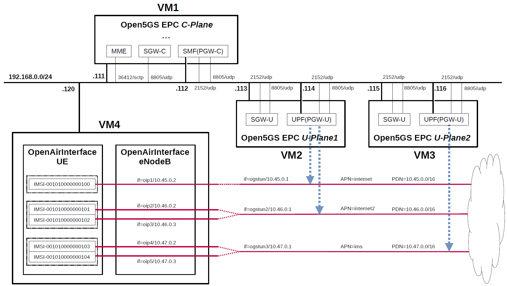

# Open5GS EPC & OpenAirInterface UE / RAN Sample Configuration
From Open5GS v2.0.22, it is possible to connect to OpenAirInterface UE / RAN v1.0.3.
Therefore, in order to use U-Plane's PDN (Packet Data Network) as a trial, I built a simulation environment for the CUPS-enabled EPC mobile network.
This briefly describes the overall and configuration files.

---

<h2 id="conf_list">List of Sample Configurations</h2>

1. [One SGW-C/PGW-C, one SGW-U/PGW-U and one APN](https://github.com/s5uishida/open5gs_epc_srsran_sample_config)
2. One SGW-C/PGW-C, Multiple SGW-Us/PGW-Us and APNs (this article)
3. [One SMF, Multiple UPFs and DNNs](https://github.com/s5uishida/open5gs_5gc_ueransim_sample_config)
4. [Select nearby UPF(PGW-U) according to the connected eNodeB](https://github.com/s5uishida/open5gs_epc_srsran_nearby_upf_sample_config)
5. [Select nearby UPF according to the connected gNodeB](https://github.com/s5uishida/open5gs_5gc_ueransim_nearby_upf_sample_config)
6. [Select UPF based on S-NSSAI](https://github.com/s5uishida/open5gs_5gc_ueransim_snssai_upf_sample_config)
7. [SCP Indirect communication Model C](https://github.com/s5uishida/open5gs_5gc_ueransim_scp_model_c_sample_config)
8. [VoLTE and SMS Configuration for docker_open5gs](https://github.com/s5uishida/docker_open5gs_volte_sms_config)
9. [Monitoring Metrics with Prometheus](https://github.com/s5uishida/open5gs_5gc_ueransim_metrics_sample_config)
10. [Framed Routing](https://github.com/s5uishida/open5gs_5gc_ueransim_framed_routing_sample_config)
11. [VPP-UPF with DPDK](https://github.com/s5uishida/open5gs_5gc_ueransim_vpp_upf_dpdk_sample_config)
---

<h2 id="misc">Miscellaneous Notes</h2>

- [Install MongoDB 6.0 and Open5GS WebUI](https://github.com/s5uishida/open5gs_install_mongodb6_webui)
---

<h2 id="toc">Table of Contents</h2>

- [Overview of Open5GS CUPS-enabled EPC Simulation Mobile Network](#overview)
- [Changes in configuration files of Open5GS EPC and OAI UE / RAN](#changes)
  - [Changes in configuration files of Open5GS EPC C-Plane](#changes_cp)
  - [Changes in configuration files of Open5GS EPC U-Plane1](#changes_up1)
  - [Changes in configuration files of Open5GS EPC U-Plane2](#changes_up2)
  - [Changes in configuration files of OAI UE / RAN](#changes_oai)
    - [Changes in configuration files of UE](#changes_ue)
    - [Changes in configuration files of RAN](#changes_ran)
- [Network settings of Open5GS EPC and OAI UE / RAN](#network_settings)
  - [Network settings of Open5GS EPC C-Plane](#network_settings_cp)
  - [Network settings of Open5GS EPC U-Plane1](#network_settings_up1)
  - [Network settings of Open5GS EPC U-Plane2](#network_settings_up2)
  - [Network settings of OAI UE / RAN](#network_settings_oai)
- [Build Open5GS and OAI UE / RAN](#build)
- [Run Open5GS EPC and OAI UE / RAN](#run)
  - [Run Open5GS EPC C-Plane](#run_cp)
  - [Run Open5GS EPC U-Plane1 & U-Plane2](#run_up)
  - [Run OAI RAN](#run_ran)
  - [Run OAI 5 UEs](#run_ue)
- [Ping google.com](#ping)
  - [Case for going through PDN 10.45.0.0/16](#ping_1)
- [Changelog (summary)](#changelog)
---

<h2 id="overview">Overview of Open5GS CUPS-enabled EPC Simulation Mobile Network</h2>

I created a CUPS-enabled EPC mobile network (Internet reachable) for simulation with the aim of creating an environment in which packets can be sent end-to-end with different PDNs for each APN.

The following minimum configuration was set as a condition.
- C-Plane have multiple U-Planes.
- U-Plane have multiple PDNs.
- Multiple UEs connect to same PDN.

The built simulation environment is as follows.

</img>

Note. The PDN end-point addresses assigned to `oipX` TUNnel interfaces are not always in the order shown in the figure above.

The EPC / UE / RAN used are as follows.
- EPC - Open5GS v2.5.6 (2023.01.13) - https://github.com/open5gs/open5gs
- UE / RAN - OpenAirInterface(OAI) v1.0.3 - https://gitlab.eurecom.fr/oai/openairinterface5g/-/tree/v1.0.3

Each VMs are as follows.  
| VM # | SW & Role | IP address | OS | Memory (Min) | HDD (Min) |
| --- | --- | --- | --- | --- | --- |
| VM1 | Open5GS EPC C-Plane | 192.168.0.111/24 <br> 192.168.0.112/24 | Ubuntu 20.04 | 1GB | 20GB |
| VM2 | Open5GS EPC U-Plane1  | 192.168.0.113/24 <br> 192.168.0.114/24 | Ubuntu 20.04 | 1GB | 20GB |
| VM3 | Open5GS EPC U-Plane2  | 192.168.0.115/24 <br> 192.168.0.116/24 | Ubuntu 20.04 | 1GB | 20GB |
| VM4 | OpenAirInterface UE / RAN | 192.168.0.120/24 | Ubuntu 18.04 | 2GB | 40GB |

OAI UE / RAN cannot be built on Ubuntu 20.04, so build it on Ubuntu 18.04.

Subscriber Information (other information is the same) is as follows.  
| UE # | IMSI | APN | OP/OPc |
| --- | --- | --- | --- |
| UE0 | 001010000000100 | internet | OPc |
| UE1 | 001010000000101 | internet2 | OPc |
| UE2 | 001010000000102 | internet2 | OPc |
| UE3 | 001010000000103 | ims | OPc |
| UE4 | 001010000000104 | ims | OPc |

I registered these information with the Open5GS WebUI.
In addition, [3GPP TS 35.208](https://www.3gpp.org/DynaReport/35208.htm) "4.3 Test Sets" is published by 3GPP as test data for the 3GPP authentication and key generation functions (MILENAGE).

Each PDNs are as follows.
| PDN | TUNnel interface of PDN | APN | TUNnel interface of UE | U-Plane # |
| --- | --- | --- | --- | --- |
| 10.45.0.0/16 | ogstun | internet | oip1 | U-Plane1 |
| 10.46.0.0/16 | ogstun2 | internet2 | oip2, oip3 | U-Plane1 |
| 10.47.0.0/16 | ogstun3 | ims | oip4, oip5 | U-Plane2 |

Additional information.

Open5GS EPC U-Plane worked fine on Raspberry Pi 4 Model B. I used [Ubuntu 20.04 (64bit) for Raspberry Pi 4](https://ubuntu.com/download/raspberry-pi) as the OS. I think it would be convenient to place a compact U-Plane in the edge environment and use it as an end-point for PDN.

In addition, I have not confirmed the communication performance.

<h2 id="changes">Changes in configuration files of Open5GS EPC and OAI UE / RAN</h2>

Please refer to the following for building Open5GS and OAI UE / RAN respectively.
- Open5GS v2.5.6 (2023.01.13) - https://open5gs.org/open5gs/docs/guide/02-building-open5gs-from-sources/
- OAI UE / RAN v1.0.3 - https://gitlab.eurecom.fr/oai/openairinterface5g/-/wikis/l2-nfapi-simulator/l2-nfapi-simulator-w-S1-same-machine

<h3 id="changes_cp">Changes in configuration files of Open5GS EPC C-Plane</h3>

The following parameters including APN can be used in the logic that selects SGW-U as the connection destination by PFCP.

- APN
- TAC (Tracking Area Code)
- e_CellID

For the sake of simplicity, I used only APN this time. Please refer to [here](https://github.com/open5gs/open5gs/pull/560#issue-483001043) for the logic to select SGW-U.

- `open5gs/install/etc/open5gs/mme.yaml`
```diff
--- mme.yaml.orig       2023-01-13 22:02:14.683885123 +0900
+++ mme.yaml    2023-01-13 22:19:08.430598218 +0900
@@ -251,7 +251,7 @@
 mme:
     freeDiameter: /root/open5gs/install/etc/freeDiameter/mme.conf
     s1ap:
-      - addr: 127.0.0.2
+      - addr: 192.168.0.111
     gtpc:
       - addr: 127.0.0.2
     metrics:
@@ -259,14 +259,14 @@
         port: 9090
     gummei:
       plmn_id:
-        mcc: 999
-        mnc: 70
+        mcc: 001
+        mnc: 01
       mme_gid: 2
       mme_code: 1
     tai:
       plmn_id:
-        mcc: 999
-        mnc: 70
+        mcc: 001
+        mnc: 01
       tac: 1
     security:
         integrity_order : [ EIA2, EIA1, EIA0 ]
@@ -396,6 +396,7 @@
 #      use_openair: true
 #
 parameter:
+    use_openair: true
 
 #
 # max:
```
When connecting with OpenAirInterface UE / RAN v1.0.3, add the following.
```
parameter:
    use_openair: true
```
- `open5gs/install/etc/open5gs/sgwc.yaml`
```diff
--- sgwc.yaml.orig      2023-01-13 22:02:14.711885500 +0900
+++ sgwc.yaml   2023-01-13 22:19:29.399785419 +0900
@@ -69,7 +69,7 @@
     gtpc:
       - addr: 127.0.0.3
     pfcp:
-      - addr: 127.0.0.3
+      - addr: 192.168.0.111
 
 #
 # sgwu:
@@ -120,7 +120,10 @@
 #
 sgwu:
     pfcp:
-      - addr: 127.0.0.6
+      - addr: 192.168.0.113
+        apn: [internet, internet2]
+      - addr: 192.168.0.115
+        apn: ims
 
 #
 # parameter:
```
- `open5gs/install/etc/open5gs/smf.yaml`
```diff
--- smf.yaml.orig       2023-01-13 22:02:14.769886280 +0900
+++ smf.yaml    2023-01-13 22:19:52.839996198 +0900
@@ -504,24 +504,22 @@
 #      maximum_integrity_protected_data_rate_downlink: bitrate64kbs|maximum-UE-rate
 #
 smf:
-    sbi:
-      - addr: 127.0.0.4
-        port: 7777
     pfcp:
-      - addr: 127.0.0.4
-      - addr: ::1
+      - addr: 192.168.0.112
     gtpc:
       - addr: 127.0.0.4
-      - addr: ::1
     gtpu:
-      - addr: 127.0.0.4
-      - addr: ::1
+      - addr: 192.168.0.112
     metrics:
       - addr: 127.0.0.4
         port: 9090
     subnet:
       - addr: 10.45.0.1/16
-      - addr: 2001:db8:cafe::1/48
+        dnn: internet
+      - addr: 10.46.0.1/16
+        dnn: internet2
+      - addr: 10.47.0.1/16
+        dnn: ims
     dns:
       - 8.8.8.8
       - 8.8.4.4
@@ -579,10 +577,6 @@
 #          l_linger: 10
 #
 #
-scp:
-    sbi:
-      - addr: 127.0.1.10
-        port: 7777
 
 #
 # nrf:
@@ -695,7 +689,10 @@
 #
 upf:
     pfcp:
-      - addr: 127.0.0.7
+      - addr: 192.168.0.114
+        dnn: [internet, internet2]
+      - addr: 192.168.0.116
+        dnn: ims
 
 #
 # parameter:
```

<h3 id="changes_up1">Changes in configuration files of Open5GS EPC U-Plane1</h3>

- `open5gs/install/etc/open5gs/sgwu.yaml`
```diff
--- sgwu.yaml.orig      2023-01-13 22:08:41.734363371 +0900
+++ sgwu.yaml   2023-01-13 22:21:27.077172515 +0900
@@ -98,9 +98,9 @@
 #
 sgwu:
     pfcp:
-      - addr: 127.0.0.6
+      - addr: 192.168.0.113
     gtpu:
-      - addr: 127.0.0.6
+      - addr: 192.168.0.113
 
 #
 # sgwc:
```
- `open5gs/install/etc/open5gs/upf.yaml`
```diff
--- upf.yaml.orig       2023-01-13 22:08:41.821362757 +0900
+++ upf.yaml    2023-01-13 22:21:45.197282445 +0900
@@ -173,12 +173,16 @@
 #
 upf:
     pfcp:
-      - addr: 127.0.0.7
+      - addr: 192.168.0.114
     gtpu:
-      - addr: 127.0.0.7
+      - addr: 192.168.0.114
     subnet:
       - addr: 10.45.0.1/16
-      - addr: 2001:db8:cafe::1/48
+        dnn: internet
+        dev: ogstun
+      - addr: 10.46.0.1/16
+        dnn: internet2
+        dev: ogstun2
     metrics:
       - addr: 127.0.0.7
         port: 9090
```

<h3 id="changes_up2">Changes in configuration files of Open5GS EPC U-Plane2</h3>

- `open5gs/install/etc/open5gs/sgwu.yaml`
```diff
--- sgwu.yaml.orig      2023-01-13 22:15:21.100408033 +0900
+++ sgwu.yaml   2023-01-13 22:22:54.561135811 +0900
@@ -98,9 +98,9 @@
 #
 sgwu:
     pfcp:
-      - addr: 127.0.0.6
+      - addr: 192.168.0.115
     gtpu:
-      - addr: 127.0.0.6
+      - addr: 192.168.0.115
 
 #
 # sgwc:
```
- `open5gs/install/etc/open5gs/upf.yaml`
```diff
--- upf.yaml.orig       2023-01-13 22:15:21.189408143 +0900
+++ upf.yaml    2023-01-13 22:23:11.987345354 +0900
@@ -173,12 +173,13 @@
 #
 upf:
     pfcp:
-      - addr: 127.0.0.7
+      - addr: 192.168.0.116
     gtpu:
-      - addr: 127.0.0.7
+      - addr: 192.168.0.116
     subnet:
-      - addr: 10.45.0.1/16
-      - addr: 2001:db8:cafe::1/48
+      - addr: 10.47.0.1/16
+        dnn: ims
+        dev: ogstun3
     metrics:
       - addr: 127.0.0.7
         port: 9090
```

<h3 id="changes_oai">Changes in configuration files of OAI UE / RAN</h3>

<h4 id="changes_ue">Changes in configuration files of UE</h4>

- `ue_folder/ci-scripts/conf_files/ue.nfapi.conf`
```diff
--- ue.nfapi.conf.orig  2020-11-22 07:54:40.846830672 +0000
+++ ue.nfapi.conf       2020-09-23 08:01:54.000000000 +0000
@@ -21,8 +21,8 @@
        num_cc = 1;
        tr_n_preference = "nfapi";
        local_n_if_name  = "lo";
-       remote_n_address = "127.0.0.2";
-       local_n_address  = "127.0.0.1";
+       remote_n_address = "127.0.0.1";
+       local_n_address  = "127.0.0.2";
        local_n_portc    = 50000;
        remote_n_portc   = 50001;
        local_n_portd    = 50010;
```
- `ue_folder/openair3/NAS/TOOLS/ue_eurecom_test_sfr.conf`
```diff
--- ue_eurecom_test_sfr.conf.orig       2020-11-22 15:33:56.000000000 +0000
+++ ue_eurecom_test_sfr.conf    2020-11-24 02:38:41.104185570 +0000
@@ -86,14 +86,162 @@
     };
 
     SIM: {
-        MSIN="0100001111";
-        USIM_API_K="8baf473f2f8fd09487cccbd7097c6862";
-        OPC="e734f8734007d6c5ce7a0508809e7e9c";
+        MSIN="0000000100";
+        USIM_API_K="465B5CE8B199B49FAA5F0A2EE238A6BC";
+        OPC="E8ED289DEBA952E4283B54E88E6183CA";
         MSISDN="33611123456";
     };
 
     # Home PLMN Selector with Access Technology
-    HPLMN= "20893";
+    HPLMN= "00101";
+
+    # User controlled PLMN Selector with Access Technology
+    UCPLMN_LIST = ();
+
+    # Operator PLMN List
+    OPLMN_LIST = ("00101", "20810", "20811", "20813", "20893", "310280", "310028");
+
+    # Operator controlled PLMN Selector with Access Technology
+    OCPLMN_LIST = ("22210", "21401", "21406", "26202", "26204");
+
+    # Forbidden plmns
+    FPLMN_LIST = ();
+
+    # List of Equivalent HPLMNs
+#TODO: UE does not connect if set, to be fixed in the UE
+#    EHPLMN_LIST= ("20811", "20813");
+    EHPLMN_LIST= ();
+};
+
+UE1:
+{
+    USER: {
+        IMEI="356113022094149";
+        MANUFACTURER="EURECOM";
+        MODEL="LTE Android PC";
+        PIN="0000";
+    };
+
+    SIM: {
+        MSIN="0000000101";
+        USIM_API_K="465B5CE8B199B49FAA5F0A2EE238A6BC";
+        OPC="E8ED289DEBA952E4283B54E88E6183CA";
+        MSISDN="33611123456";
+    };
+
+    # Home PLMN Selector with Access Technology
+    HPLMN= "00101";
+
+    # User controlled PLMN Selector with Access Technology
+    UCPLMN_LIST = ();
+
+    # Operator PLMN List
+    OPLMN_LIST = ("00101", "20810", "20811", "20813", "20893", "310280", "310028");
+
+    # Operator controlled PLMN Selector with Access Technology
+    OCPLMN_LIST = ("22210", "21401", "21406", "26202", "26204");
+
+    # Forbidden plmns
+    FPLMN_LIST = ();
+
+    # List of Equivalent HPLMNs
+#TODO: UE does not connect if set, to be fixed in the UE
+#    EHPLMN_LIST= ("20811", "20813");
+    EHPLMN_LIST= ();
+};
+
+UE2:
+{
+    USER: {
+        IMEI="356113022094149";
+        MANUFACTURER="EURECOM";
+        MODEL="LTE Android PC";
+        PIN="0000";
+    };
+
+    SIM: {
+        MSIN="0000000102";
+        USIM_API_K="465B5CE8B199B49FAA5F0A2EE238A6BC";
+        OPC="E8ED289DEBA952E4283B54E88E6183CA";
+        MSISDN="33611123456";
+    };
+
+    # Home PLMN Selector with Access Technology
+    HPLMN= "00101";
+
+    # User controlled PLMN Selector with Access Technology
+    UCPLMN_LIST = ();
+
+    # Operator PLMN List
+    OPLMN_LIST = ("00101", "20810", "20811", "20813", "20893", "310280", "310028");
+
+    # Operator controlled PLMN Selector with Access Technology
+    OCPLMN_LIST = ("22210", "21401", "21406", "26202", "26204");
+
+    # Forbidden plmns
+    FPLMN_LIST = ();
+
+    # List of Equivalent HPLMNs
+#TODO: UE does not connect if set, to be fixed in the UE
+#    EHPLMN_LIST= ("20811", "20813");
+    EHPLMN_LIST= ();
+};
+
+UE3:
+{
+    USER: {
+        IMEI="356113022094149";
+        MANUFACTURER="EURECOM";
+        MODEL="LTE Android PC";
+        PIN="0000";
+    };
+
+    SIM: {
+        MSIN="0000000103";
+        USIM_API_K="465B5CE8B199B49FAA5F0A2EE238A6BC";
+        OPC="E8ED289DEBA952E4283B54E88E6183CA";
+        MSISDN="33611123456";
+    };
+
+    # Home PLMN Selector with Access Technology
+    HPLMN= "00101";
+
+    # User controlled PLMN Selector with Access Technology
+    UCPLMN_LIST = ();
+
+    # Operator PLMN List
+    OPLMN_LIST = ("00101", "20810", "20811", "20813", "20893", "310280", "310028");
+
+    # Operator controlled PLMN Selector with Access Technology
+    OCPLMN_LIST = ("22210", "21401", "21406", "26202", "26204");
+
+    # Forbidden plmns
+    FPLMN_LIST = ();
+
+    # List of Equivalent HPLMNs
+#TODO: UE does not connect if set, to be fixed in the UE
+#    EHPLMN_LIST= ("20811", "20813");
+    EHPLMN_LIST= ();
+};
+
+UE4:
+{
+    USER: {
+        IMEI="356113022094149";
+        MANUFACTURER="EURECOM";
+        MODEL="LTE Android PC";
+        PIN="0000";
+    };
+
+    SIM: {
+        MSIN="0000000104";
+        USIM_API_K="465B5CE8B199B49FAA5F0A2EE238A6BC";
+        OPC="E8ED289DEBA952E4283B54E88E6183CA";
+        MSISDN="33611123456";
+    };
+
+    # Home PLMN Selector with Access Technology
+    HPLMN= "00101";
 
     # User controlled PLMN Selector with Access Technology
     UCPLMN_LIST = ();
```
<h4 id="changes_ran">Changes in configuration files of RAN</h4>

- `enb_folder/ci-scripts/conf_files/rcc.band7.tm1.nfapi.conf`
```diff
--- rcc.band7.tm1.nfapi.conf.orig       2020-11-22 15:33:38.000000000 +0000
+++ rcc.band7.tm1.nfapi.conf    2020-11-24 01:00:23.936598997 +0000
@@ -15,7 +15,7 @@
     // Tracking area code, 0x0000 and 0xfffe are reserved values
     tracking_area_code = 1;
 
-    plmn_list = ( { mcc = 208; mnc = 93; mnc_length = 2; } );
+    plmn_list = ( { mcc = 001; mnc = 01; mnc_length = 2; } );
 
     tr_s_preference     = "local_mac"
 
@@ -172,7 +172,7 @@
 
 
     ////////// MME parameters:
-    mme_ip_address      = ( { ipv4       = "CI_MME_IP_ADDR";
+    mme_ip_address      = ( { ipv4       = "192.168.0.111";
                               ipv6       = "192:168:30::17";
                               active     = "yes";
                               preference = "ipv4";
@@ -181,12 +181,12 @@
 
     NETWORK_INTERFACES :
     {
-        ENB_INTERFACE_NAME_FOR_S1_MME            = "ens3";
-        ENB_IPV4_ADDRESS_FOR_S1_MME              = "CI_ENB_IP_ADDR";
-        ENB_INTERFACE_NAME_FOR_S1U               = "ens3";
-        ENB_IPV4_ADDRESS_FOR_S1U                 = "CI_ENB_IP_ADDR";
+        ENB_INTERFACE_NAME_FOR_S1_MME            = "enp0s8";
+        ENB_IPV4_ADDRESS_FOR_S1_MME              = "192.168.0.120/24";
+        ENB_INTERFACE_NAME_FOR_S1U               = "enp0s8";
+        ENB_IPV4_ADDRESS_FOR_S1U                 = "192.168.0.120/24";
         ENB_PORT_FOR_S1U                         = 2152; # Spec 2152
-        ENB_IPV4_ADDRESS_FOR_X2C                 = "CI_ENB_IP_ADDR";
+        ENB_IPV4_ADDRESS_FOR_X2C                 = "192.168.0.120/24";
         ENB_PORT_FOR_X2C                         = 36422; # Spec 36422
         
     };
@@ -197,8 +197,8 @@
        {
        num_cc = 1;
        local_s_if_name  = "lo:";                         
-       remote_s_address = "127.0.0.1";
-       local_s_address  = "127.0.0.2"; 
+       remote_s_address = "127.0.0.2";
+       local_s_address  = "127.0.0.1"; 
        local_s_portc    = 50001;
        remote_s_portc   = 50000;
        local_s_portd    = 50011;
```

<h2 id="network_settings">Network settings of Open5GS EPC and OAI UE / RAN</h2>

<h3 id="network_settings_cp">Network settings of Open5GS EPC C-Plane</h3>

Add IP address for SMF(PGW-C).
```
ip addr add 192.168.0.112/24 dev enp0s8
```
**Note. `enp0s8` is the network interface of `192.168.0.0/24` in my VirtualBox environment.
Please change it according to your environment.**

<h3 id="network_settings_up1">Network settings of Open5GS EPC U-Plane1</h3>

First, uncomment the next line in the `/etc/sysctl.conf` file and reflect it in the OS.
```
net.ipv4.ip_forward=1
```
```
# sysctl -p
```
Next, add IP address for UPF(PGW-U) and configure the TUNnel interface and NAPT.
```
ip addr add 192.168.0.114/24 dev enp0s8

ip tuntap add name ogstun mode tun
ip addr add 10.45.0.1/16 dev ogstun
ip link set ogstun up

iptables -t nat -A POSTROUTING -s 10.45.0.0/16 ! -o ogstun -j MASQUERADE

ip tuntap add name ogstun2 mode tun
ip addr add 10.46.0.1/16 dev ogstun2
ip link set ogstun2 up

iptables -t nat -A POSTROUTING -s 10.46.0.0/16 ! -o ogstun2 -j MASQUERADE
```

<h3 id="network_settings_up2">Network settings of Open5GS EPC U-Plane2</h3>

First, uncomment the next line in the `/etc/sysctl.conf` file and reflect it in the OS.
```
net.ipv4.ip_forward=1
```
```
# sysctl -p
```
Next, add IP address for UPF(PGW-U) and configure the TUNnel interface and NAPT.
```
ip addr add 192.168.0.116/24 dev enp0s8

ip tuntap add name ogstun3 mode tun
ip addr add 10.47.0.1/16 dev ogstun3
ip link set ogstun3 up

iptables -t nat -A POSTROUTING -s 10.47.0.0/16 ! -o ogstun3 -j MASQUERADE
```

<h3 id="network_settings_oai">Network settings of OAI UE / RAN</h3>

```
ifconfig lo: 127.0.0.2 netmask 255.0.0.0 up
```

<h2 id="build">Build Open5GS and OAI UE / RAN</h2>

Please refer to the following for building Open5GS and OAI UE / RAN respectively.
- Open5GS v2.5.6 (2023.01.13) - https://open5gs.org/open5gs/docs/guide/02-building-open5gs-from-sources/
- OAI UE / RAN v1.0.3 - https://gitlab.eurecom.fr/oai/openairinterface5g/-/wikis/l2-nfapi-simulator/l2-nfapi-simulator-w-S1-same-machine

Install MongoDB on Open5GS EPC C-Plane machine.
It is not necessary to install MongoDB on Open5GS EPC U-Plane machines.
[MongoDB Compass](https://www.mongodb.com/products/compass) is a convenient tool to look at the MongoDB database.

Note. When building OAI UE / RAN, add `-I` to the parameter of the `build_oai` command for the first time.
The following is an example of building eNB.
```
./build_oai -I --eNB -t ETHERNET -c
```
<h2 id="run">Run Open5GS EPC and OAI UE / RAN</h2>

First run the EPC, then the RAN, and the UE.

<h3 id="run_cp">Run Open5GS EPC C-Plane</h3>

First, run Open5GS EPC C-Plane.

- Open5GS EPC C-Plane
```
./install/bin/open5gs-mmed &
./install/bin/open5gs-sgwcd &
./install/bin/open5gs-smfd &
./install/bin/open5gs-hssd &
./install/bin/open5gs-pcrfd &
```

<h3 id="run_up">Run Open5GS EPC U-Plane1 & U-Plane2</h3>

Next, run Open5GS EPC U-Plane.

- Open5GS EPC U-Plane1
```
./install/bin/open5gs-sgwud &
./install/bin/open5gs-upfd &
```
- Open5GS EPC U-Plane2
```
./install/bin/open5gs-sgwud &
./install/bin/open5gs-upfd &
```

<h3 id="run_ran">Run OAI RAN</h3>

Run OAI eNB and connect to Open5GS EPC.
```
# cd ~/enb_folder/cmake_targets
# ./lte_build_oai/build/lte-softmodem -O ../ci-scripts/conf_files/rcc.band7.tm1.nfapi.conf 2>&1 | tee enb.log
```
The Open5GS C-Plane log when executed is as follows.
```
01/13 23:10:08.071: [mme] INFO: eNB-S1 accepted[192.168.0.120]:36412 in s1_path module (../src/mme/s1ap-sctp.c:114)
01/13 23:10:08.071: [mme] INFO: eNB-S1 accepted[192.168.0.120] in master_sm module (../src/mme/mme-sm.c:106)
01/13 23:10:08.071: [mme] INFO: [Added] Number of eNBs is now 1 (../src/mme/mme-context.c:1925)
01/13 23:10:08.071: [mme] INFO: eNB-S1[192.168.0.120] max_num_of_ostreams : 2 (../src/mme/mme-sm.c:148)
```

<h3 id="run_ue">Run OAI 5 UEs</h3>

Run OAI 5 UEs and connect to Open5GS EPC.
Add `--num-ues 5` to the parameter to use 5 UEs.
```
# cd ~/ue_folder/cmake_targets/tools
# source init_nas_s1 UE
# cd ..
# ./lte_build_oai/build/lte-uesoftmodem -O ../ci-scripts/conf_files/ue.nfapi.conf --L2-emul 3 --num-ues 5 2>&1 | tee ue.log
```
The Open5GS C-Plane log when executed is as follows.
5 UEs connected to the EPC and each PDU session was established.
```
01/13 23:10:32.395: [mme] INFO: InitialUEMessage (../src/mme/s1ap-handler.c:223)
01/13 23:10:32.395: [mme] INFO: [Added] Number of eNB-UEs is now 1 (../src/mme/mme-context.c:3629)
01/13 23:10:32.395: [mme] INFO:     ENB_UE_S1AP_ID[420141] MME_UE_S1AP_ID[1] TAC[1] CellID[0xe0000] (../src/mme/s1ap-handler.c:369)
01/13 23:10:32.395: [mme] INFO: [001010000000100] Unknown UE by IMSI (../src/mme/mme-context.c:2614)
01/13 23:10:32.395: [mme] INFO: [Added] Number of MME-UEs is now 1 (../src/mme/mme-context.c:2441)
01/13 23:10:32.395: [emm] INFO: [] Attach request (../src/mme/emm-sm.c:306)
01/13 23:10:32.395: [emm] INFO:     IMSI[001010000000100] (../src/mme/emm-handler.c:193)
01/13 23:10:32.455: [mme] INFO: [Added] Number of MME-Sessions is now 1 (../src/mme/mme-context.c:3643)
01/13 23:10:32.456: [sgwc] INFO: [Added] Number of SGWC-UEs is now 1 (../src/sgwc/context.c:210)
01/13 23:10:32.456: [sgwc] INFO: [Added] Number of SGWC-Sessions is now 1 (../src/sgwc/context.c:891)
01/13 23:10:32.457: [gtp] INFO: gtp_connect() [127.0.0.4]:2123 (../lib/gtp/path.c:60)
01/13 23:10:32.457: [smf] INFO: [Added] Number of SMF-UEs is now 1 (../src/smf/context.c:1009)
01/13 23:10:32.457: [smf] INFO: [Added] Number of SMF-Sessions is now 1 (../src/smf/context.c:3088)
01/13 23:10:32.457: [smf] INFO: UE IMSI[001010000000100] APN[internet] IPv4[10.45.0.2] IPv6[] (../src/smf/s5c-handler.c:255)
01/13 23:10:32.463: [gtp] INFO: gtp_connect() [192.168.0.114]:2152 (../lib/gtp/path.c:60)
01/13 23:10:32.463: [gtp] INFO: gtp_connect() [127.0.0.4]:2123 (../lib/gtp/path.c:60)
01/13 23:10:32.714: [emm] INFO: [001010000000100] Attach complete (../src/mme/emm-sm.c:1082)
01/13 23:10:32.715: [emm] INFO:     IMSI[001010000000100] (../src/mme/emm-handler.c:242)
01/13 23:10:32.715: [emm] INFO:     UTC [2023-01-13T14:10:32] Timezone[0]/DST[0] (../src/mme/emm-handler.c:248)
01/13 23:10:32.715: [emm] INFO:     LOCAL [2023-01-13T23:10:32] Timezone[32400]/DST[0] (../src/mme/emm-handler.c:252)
01/13 23:10:32.717: [mme] INFO: InitialUEMessage (../src/mme/s1ap-handler.c:223)
01/13 23:10:32.717: [mme] INFO: [Added] Number of eNB-UEs is now 2 (../src/mme/mme-context.c:3629)
01/13 23:10:32.717: [mme] INFO:     ENB_UE_S1AP_ID[16398672] MME_UE_S1AP_ID[2] TAC[1] CellID[0xe0000] (../src/mme/s1ap-handler.c:369)
01/13 23:10:32.718: [mme] INFO: [001010000000101] Unknown UE by IMSI (../src/mme/mme-context.c:2614)
01/13 23:10:32.718: [mme] INFO: [Added] Number of MME-UEs is now 2 (../src/mme/mme-context.c:2441)
01/13 23:10:32.718: [emm] INFO: [] Attach request (../src/mme/emm-sm.c:306)
01/13 23:10:32.718: [emm] INFO:     IMSI[001010000000101] (../src/mme/emm-handler.c:193)
01/13 23:10:32.767: [mme] INFO: [Added] Number of MME-Sessions is now 2 (../src/mme/mme-context.c:3643)
01/13 23:10:32.767: [sgwc] INFO: [Added] Number of SGWC-UEs is now 2 (../src/sgwc/context.c:210)
01/13 23:10:32.768: [sgwc] INFO: [Added] Number of SGWC-Sessions is now 2 (../src/sgwc/context.c:891)
01/13 23:10:32.769: [smf] INFO: [Added] Number of SMF-UEs is now 2 (../src/smf/context.c:1009)
01/13 23:10:32.770: [smf] INFO: [Added] Number of SMF-Sessions is now 2 (../src/smf/context.c:3088)
01/13 23:10:32.770: [smf] INFO: UE IMSI[001010000000101] APN[internet2] IPv4[10.46.0.2] IPv6[] (../src/smf/s5c-handler.c:255)
01/13 23:10:32.795: [mme] INFO: InitialUEMessage (../src/mme/s1ap-handler.c:223)
01/13 23:10:32.795: [mme] INFO: [Added] Number of eNB-UEs is now 3 (../src/mme/mme-context.c:3629)
01/13 23:10:32.795: [mme] INFO:     ENB_UE_S1AP_ID[7773174] MME_UE_S1AP_ID[3] TAC[1] CellID[0xe0000] (../src/mme/s1ap-handler.c:369)
01/13 23:10:32.796: [mme] INFO: [001010000000102] Unknown UE by IMSI (../src/mme/mme-context.c:2614)
01/13 23:10:32.796: [mme] INFO: [Added] Number of MME-UEs is now 3 (../src/mme/mme-context.c:2441)
01/13 23:10:32.796: [emm] INFO: [] Attach request (../src/mme/emm-sm.c:306)
01/13 23:10:32.797: [emm] INFO:     IMSI[001010000000102] (../src/mme/emm-handler.c:193)
01/13 23:10:33.027: [emm] INFO: [001010000000101] Attach complete (../src/mme/emm-sm.c:1082)
01/13 23:10:33.029: [emm] INFO:     IMSI[001010000000101] (../src/mme/emm-handler.c:242)
01/13 23:10:33.029: [emm] INFO:     UTC [2023-01-13T14:10:33] Timezone[0]/DST[0] (../src/mme/emm-handler.c:248)
01/13 23:10:33.030: [emm] INFO:     LOCAL [2023-01-13T23:10:33] Timezone[32400]/DST[0] (../src/mme/emm-handler.c:252)
01/13 23:10:33.033: [mme] INFO: [Added] Number of MME-Sessions is now 3 (../src/mme/mme-context.c:3643)
01/13 23:10:33.034: [sgwc] INFO: [Added] Number of SGWC-UEs is now 3 (../src/sgwc/context.c:210)
01/13 23:10:33.034: [sgwc] INFO: [Added] Number of SGWC-Sessions is now 3 (../src/sgwc/context.c:891)
01/13 23:10:33.035: [mme] INFO: InitialUEMessage (../src/mme/s1ap-handler.c:223)
01/13 23:10:33.035: [mme] INFO: [Added] Number of eNB-UEs is now 4 (../src/mme/mme-context.c:3629)
01/13 23:10:33.036: [smf] INFO: [Added] Number of SMF-UEs is now 3 (../src/smf/context.c:1009)
01/13 23:10:33.036: [smf] INFO: [Added] Number of SMF-Sessions is now 3 (../src/smf/context.c:3088)
01/13 23:10:33.037: [smf] INFO: UE IMSI[001010000000102] APN[internet2] IPv4[10.46.0.3] IPv6[] (../src/smf/s5c-handler.c:255)
01/13 23:10:33.040: [mme] INFO:     ENB_UE_S1AP_ID[10104933] MME_UE_S1AP_ID[4] TAC[1] CellID[0xe0000] (../src/mme/s1ap-handler.c:369)
01/13 23:10:33.040: [mme] INFO: [001010000000103] Unknown UE by IMSI (../src/mme/mme-context.c:2614)
01/13 23:10:33.041: [mme] INFO: [Added] Number of MME-UEs is now 4 (../src/mme/mme-context.c:2441)
01/13 23:10:33.041: [emm] INFO: [] Attach request (../src/mme/emm-sm.c:306)
01/13 23:10:33.041: [emm] INFO:     IMSI[001010000000103] (../src/mme/emm-handler.c:193)
01/13 23:10:33.059: [mme] INFO: [Added] Number of MME-Sessions is now 4 (../src/mme/mme-context.c:3643)
01/13 23:10:33.059: [sgwc] INFO: [Added] Number of SGWC-UEs is now 4 (../src/sgwc/context.c:210)
01/13 23:10:33.060: [sgwc] INFO: [Added] Number of SGWC-Sessions is now 4 (../src/sgwc/context.c:891)
01/13 23:10:33.061: [smf] INFO: [Added] Number of SMF-UEs is now 4 (../src/smf/context.c:1009)
01/13 23:10:33.061: [smf] INFO: [Added] Number of SMF-Sessions is now 4 (../src/smf/context.c:3088)
01/13 23:10:33.061: [smf] INFO: UE IMSI[001010000000103] APN[ims] IPv4[10.47.0.2] IPv6[] (../src/smf/s5c-handler.c:255)
01/13 23:10:33.064: [gtp] INFO: gtp_connect() [192.168.0.116]:2152 (../lib/gtp/path.c:60)
01/13 23:10:33.275: [emm] INFO: [001010000000102] Attach complete (../src/mme/emm-sm.c:1082)
01/13 23:10:33.275: [emm] INFO:     IMSI[001010000000102] (../src/mme/emm-handler.c:242)
01/13 23:10:33.276: [emm] INFO:     UTC [2023-01-13T14:10:33] Timezone[0]/DST[0] (../src/mme/emm-handler.c:248)
01/13 23:10:33.276: [emm] INFO:     LOCAL [2023-01-13T23:10:33] Timezone[32400]/DST[0] (../src/mme/emm-handler.c:252)
01/13 23:10:33.277: [emm] INFO: [001010000000103] Attach complete (../src/mme/emm-sm.c:1082)
01/13 23:10:33.278: [emm] INFO:     IMSI[001010000000103] (../src/mme/emm-handler.c:242)
01/13 23:10:33.278: [emm] INFO:     UTC [2023-01-13T14:10:33] Timezone[0]/DST[0] (../src/mme/emm-handler.c:248)
01/13 23:10:33.278: [emm] INFO:     LOCAL [2023-01-13T23:10:33] Timezone[32400]/DST[0] (../src/mme/emm-handler.c:252)
01/13 23:10:33.279: [mme] INFO: InitialUEMessage (../src/mme/s1ap-handler.c:223)
01/13 23:10:33.279: [mme] INFO: [Added] Number of eNB-UEs is now 5 (../src/mme/mme-context.c:3629)
01/13 23:10:33.280: [mme] INFO:     ENB_UE_S1AP_ID[3105598] MME_UE_S1AP_ID[5] TAC[1] CellID[0xe0000] (../src/mme/s1ap-handler.c:369)
01/13 23:10:33.280: [mme] INFO: [001010000000104] Unknown UE by IMSI (../src/mme/mme-context.c:2614)
01/13 23:10:33.281: [mme] INFO: [Added] Number of MME-UEs is now 5 (../src/mme/mme-context.c:2441)
01/13 23:10:33.281: [emm] INFO: [] Attach request (../src/mme/emm-sm.c:306)
01/13 23:10:33.281: [emm] INFO:     IMSI[001010000000104] (../src/mme/emm-handler.c:193)
01/13 23:10:33.339: [mme] INFO: [Added] Number of MME-Sessions is now 5 (../src/mme/mme-context.c:3643)
01/13 23:10:33.340: [sgwc] INFO: [Added] Number of SGWC-UEs is now 5 (../src/sgwc/context.c:210)
01/13 23:10:33.340: [sgwc] INFO: [Added] Number of SGWC-Sessions is now 5 (../src/sgwc/context.c:891)
01/13 23:10:33.342: [smf] INFO: [Added] Number of SMF-UEs is now 5 (../src/smf/context.c:1009)
01/13 23:10:33.342: [smf] INFO: [Added] Number of SMF-Sessions is now 5 (../src/smf/context.c:3088)
01/13 23:10:33.342: [smf] INFO: UE IMSI[001010000000104] APN[ims] IPv4[10.47.0.3] IPv6[] (../src/smf/s5c-handler.c:255)
01/13 23:10:33.594: [emm] INFO: [001010000000104] Attach complete (../src/mme/emm-sm.c:1082)
01/13 23:10:33.595: [emm] INFO:     IMSI[001010000000104] (../src/mme/emm-handler.c:242)
01/13 23:10:33.595: [emm] INFO:     UTC [2023-01-13T14:10:33] Timezone[0]/DST[0] (../src/mme/emm-handler.c:248)
01/13 23:10:33.595: [emm] INFO:     LOCAL [2023-01-13T23:10:33] Timezone[32400]/DST[0] (../src/mme/emm-handler.c:252)
```
The Open5GS U-Plane1 log when executed is as follows.
3 GTP-U sessions have been created.
```
01/13 23:10:32.462: [sgwu] INFO: UE F-SEID[UP:0x1 CP:0x1] (../src/sgwu/context.c:157)
01/13 23:10:32.462: [sgwu] INFO: [Added] Number of SGWU-Sessions is now 1 (../src/sgwu/context.c:162)
01/13 23:10:32.467: [upf] INFO: [Added] Number of UPF-Sessions is now 1 (../src/upf/context.c:181)
01/13 23:10:32.467: [gtp] INFO: gtp_connect() [192.168.0.113]:2152 (../lib/gtp/path.c:60)
01/13 23:10:32.467: [gtp] INFO: gtp_connect() [192.168.0.112]:2152 (../lib/gtp/path.c:60)
01/13 23:10:32.467: [upf] INFO: UE F-SEID[UP:0x1 CP:0x1] APN[internet] PDN-Type[1] IPv4[10.45.0.2] IPv6[] (../src/upf/context.c:401)
01/13 23:10:32.468: [upf] INFO: UE F-SEID[UP:0x1 CP:0x1] APN[internet] PDN-Type[1] IPv4[10.45.0.2] IPv6[] (../src/upf/context.c:401)
01/13 23:10:32.469: [gtp] INFO: gtp_connect() [192.168.0.114]:2152 (../lib/gtp/path.c:60)
01/13 23:10:32.722: [gtp] INFO: gtp_connect() [192.168.0.120]:2152 (../lib/gtp/path.c:60)
01/13 23:10:32.774: [sgwu] INFO: UE F-SEID[UP:0x2 CP:0x2] (../src/sgwu/context.c:157)
01/13 23:10:32.774: [sgwu] INFO: [Added] Number of SGWU-Sessions is now 2 (../src/sgwu/context.c:162)
01/13 23:10:32.778: [upf] INFO: [Added] Number of UPF-Sessions is now 2 (../src/upf/context.c:181)
01/13 23:10:32.779: [upf] INFO: UE F-SEID[UP:0x2 CP:0x2] APN[internet2] PDN-Type[1] IPv4[10.46.0.2] IPv6[] (../src/upf/context.c:401)
01/13 23:10:32.779: [upf] INFO: UE F-SEID[UP:0x2 CP:0x2] APN[internet2] PDN-Type[1] IPv4[10.46.0.2] IPv6[] (../src/upf/context.c:401)
01/13 23:10:33.041: [sgwu] INFO: UE F-SEID[UP:0x3 CP:0x3] (../src/sgwu/context.c:157)
01/13 23:10:33.041: [sgwu] INFO: [Added] Number of SGWU-Sessions is now 3 (../src/sgwu/context.c:162)
01/13 23:10:33.045: [upf] INFO: [Added] Number of UPF-Sessions is now 3 (../src/upf/context.c:181)
01/13 23:10:33.046: [upf] INFO: UE F-SEID[UP:0x3 CP:0x3] APN[internet2] PDN-Type[1] IPv4[10.46.0.3] IPv6[] (../src/upf/context.c:401)
01/13 23:10:33.046: [upf] INFO: UE F-SEID[UP:0x3 CP:0x3] APN[internet2] PDN-Type[1] IPv4[10.46.0.3] IPv6[] (../src/upf/context.c:401)
```
The Open5GS U-Plane2 log when executed is as follows.
2 GTP-U sessions have been created.
```
01/13 23:10:33.056: [sgwu] INFO: UE F-SEID[UP:0x1 CP:0x4] (../src/sgwu/context.c:157)
01/13 23:10:33.056: [sgwu] INFO: [Added] Number of SGWU-Sessions is now 1 (../src/sgwu/context.c:162)
01/13 23:10:33.059: [upf] INFO: [Added] Number of UPF-Sessions is now 1 (../src/upf/context.c:181)
01/13 23:10:33.059: [gtp] INFO: gtp_connect() [192.168.0.115]:2152 (../lib/gtp/path.c:60)
01/13 23:10:33.059: [gtp] INFO: gtp_connect() [192.168.0.112]:2152 (../lib/gtp/path.c:60)
01/13 23:10:33.059: [upf] INFO: UE F-SEID[UP:0x1 CP:0x4] APN[ims] PDN-Type[1] IPv4[10.47.0.2] IPv6[] (../src/upf/context.c:401)
01/13 23:10:33.059: [upf] INFO: UE F-SEID[UP:0x1 CP:0x4] APN[ims] PDN-Type[1] IPv4[10.47.0.2] IPv6[] (../src/upf/context.c:401)
01/13 23:10:33.060: [gtp] INFO: gtp_connect() [192.168.0.116]:2152 (../lib/gtp/path.c:60)
01/13 23:10:33.275: [gtp] INFO: gtp_connect() [192.168.0.120]:2152 (../lib/gtp/path.c:60)
01/13 23:10:33.336: [sgwu] INFO: UE F-SEID[UP:0x2 CP:0x5] (../src/sgwu/context.c:157)
01/13 23:10:33.336: [sgwu] INFO: [Added] Number of SGWU-Sessions is now 2 (../src/sgwu/context.c:162)
01/13 23:10:33.340: [upf] INFO: [Added] Number of UPF-Sessions is now 2 (../src/upf/context.c:181)
01/13 23:10:33.340: [upf] INFO: UE F-SEID[UP:0x2 CP:0x5] APN[ims] PDN-Type[1] IPv4[10.47.0.3] IPv6[] (../src/upf/context.c:401)
01/13 23:10:33.340: [upf] INFO: UE F-SEID[UP:0x2 CP:0x5] APN[ims] PDN-Type[1] IPv4[10.47.0.3] IPv6[] (../src/upf/context.c:401)
```
The result of `ip addr show` on VM4 (OAI UE) is as follows.
```
# ip addr show
...
52: oip1: <BROADCAST,MULTICAST,NOARP,UP,LOWER_UP> mtu 1500 qdisc fq_codel state UNKNOWN group default qlen 100
    link/generic 00:00:00:00:00:00:00:00 brd 00:00:00:00:00:00:00:00
    inet 10.45.0.2/8 brd 10.255.255.255 scope global oip1
       valid_lft forever preferred_lft forever
53: oip2: <BROADCAST,MULTICAST,NOARP,UP,LOWER_UP> mtu 1500 qdisc fq_codel state UNKNOWN group default qlen 100
    link/generic 00:00:00:00:00:00:00:00 brd 00:00:00:00:00:00:00:00
    inet 10.46.0.2/8 brd 10.255.255.255 scope global oip2
       valid_lft forever preferred_lft forever
54: oip3: <BROADCAST,MULTICAST,NOARP,UP,LOWER_UP> mtu 1500 qdisc fq_codel state UNKNOWN group default qlen 100
    link/generic 00:00:00:00:00:00:00:00 brd 00:00:00:00:00:00:00:00
    inet 10.46.0.3/8 brd 10.255.255.255 scope global oip3
       valid_lft forever preferred_lft forever
55: oip4: <BROADCAST,MULTICAST,NOARP,UP,LOWER_UP> mtu 1500 qdisc fq_codel state UNKNOWN group default qlen 100
    link/generic 00:00:00:00:00:00:00:00 brd 00:00:00:00:00:00:00:00
    inet 10.47.0.2/8 brd 10.255.255.255 scope global oip4
       valid_lft forever preferred_lft forever
56: oip5: <BROADCAST,MULTICAST,NOARP,UP,LOWER_UP> mtu 1500 qdisc fq_codel state UNKNOWN group default qlen 100
    link/generic 00:00:00:00:00:00:00:00 brd 00:00:00:00:00:00:00:00
    inet 10.47.0.3/8 brd 10.255.255.255 scope global oip5
       valid_lft forever preferred_lft forever
...
```

<h2 id="ping">Ping google.com</h2>

Specify the TUN interface on VM4 (UE0) and try `ping`.

<h3 id="ping_1">Case for going through PDN 10.45.0.0/16</h3>

Execute `tcpdump` on VM2 (U-Plane1) and check that the packet goes through `if=ogstun`.
- `ping google.com` on VM4 (UE0)
```
# ping google.com -I oip1 -n
PING google.com (172.217.174.110) from 10.45.0.2 oip1: 56(84) bytes of data.
64 bytes from 172.217.174.110: icmp_seq=1 ttl=61 time=45.7 ms
64 bytes from 172.217.174.110: icmp_seq=2 ttl=61 time=43.0 ms
64 bytes from 172.217.174.110: icmp_seq=3 ttl=61 time=33.1 ms
```
- Run `tcpdump` on VM2 (U-Plane1)
```
# tcpdump -i ogstun -n
tcpdump: verbose output suppressed, use -v or -vv for full protocol decode
listening on ogstun, link-type RAW (Raw IP), capture size 262144 bytes
23:11:19.027312 IP 10.45.0.2 > 172.217.174.110: ICMP echo request, id 3381, seq 1, length 64
23:11:19.047172 IP 172.217.174.110 > 10.45.0.2: ICMP echo reply, id 3381, seq 1, length 64
23:11:20.026815 IP 10.45.0.2 > 172.217.174.110: ICMP echo request, id 3381, seq 2, length 64
23:11:20.044912 IP 172.217.174.110 > 10.45.0.2: ICMP echo reply, id 3381, seq 2, length 64
23:11:21.019346 IP 10.45.0.2 > 172.217.174.110: ICMP echo request, id 3381, seq 3, length 64
23:11:21.036928 IP 172.217.174.110 > 10.45.0.2: ICMP echo reply, id 3381, seq 3, length 64
```
For `oip2`-`oip5` as well, execute `tcpdump` on each U-Plane and check the packets flowing through `ogstunX`.

You could now create the end-to-end TUN interfaces on the PDN and send any packets on the network.

---
In investigating private LTE, I have built a simulation environment and can now use a very useful system for investigating CUPS-enabled EPC and MEC of LTE mobile network.
I would like to thank the excellent developers and all the contributors of Open5GS and OpenAirInterface.

<h2 id="changelog">Changelog (summary)</h2>

- [2023.01.13] Updated to Open5GS v2.5.6.
- [2022.06.05] Updated to Open5GS v2.4.7 and assigned IP addresses to each of SMF(PGW-C) and UPF(PGW-U).
- [2022.04.05] Updated to Open5GS v2.4.5 and removed the connection setting to NRF in smf.yaml.
- [2021.03.09] Updated to Open5GS v2.2.0.
- [2020.11.24] Initial release.
